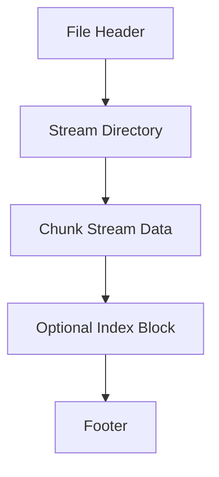
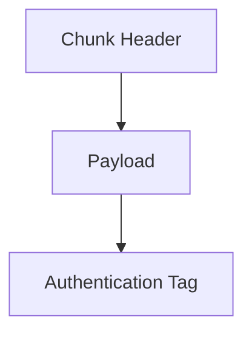
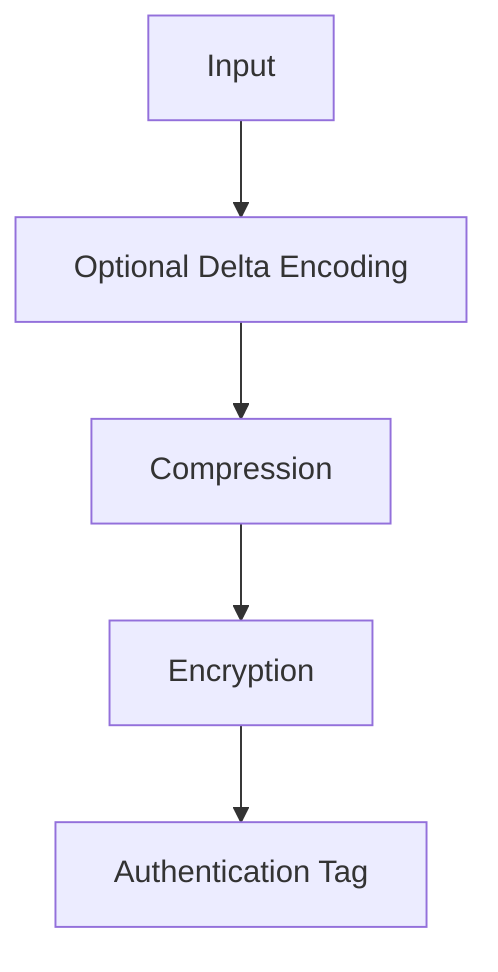
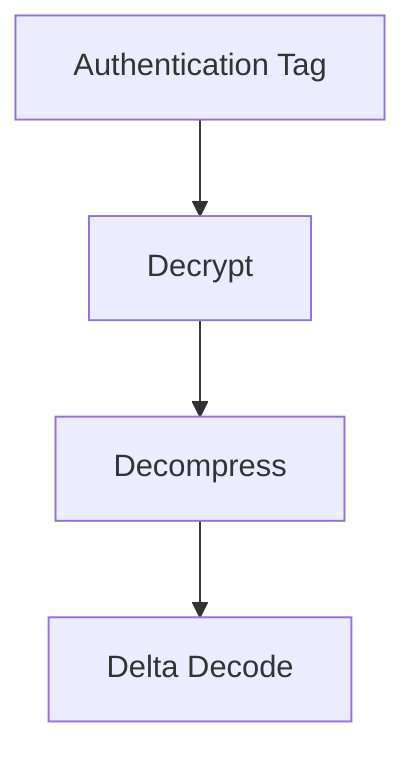
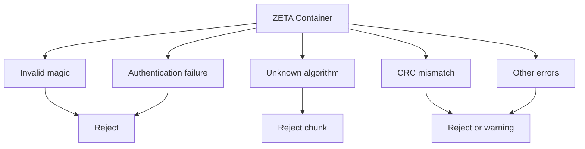

# Zero-Trust Extended Archive Format (ZETA)

## Version 1.0

---

## 1. Abstract

Zero-Trust Extended Archive (ZETA) is a chunk-oriented, zero-trust container format designed for streaming, archival storage, and multi-object encapsulation. It supports pluggable compression, encryption, hashing, and key derivation functions, while maintaining strict cryptographic integrity guarantees.

ZETA is optimized for:

* High-throughput streaming
* Random-access retrieval
* Content-addressable storage (optional)
* Secure archival and distribution

---

## 2. Conventions

* All multi-byte integers are **little-endian (LE)**
* Fields marked **MUST** are mandatory for compliance
* Fields marked **MAY** are optional extensions
* Unknown fields **MUST** be safely ignored if length is provided

---

## 3. File Structure

A ZETA file is composed of the following logical regions:



---

## 4. File Header

### 4.1 Fixed Layout (144 bytes)

| Offset | Size | Field                                                                |
| ------ | ---- | -------------------------------------------------------------------- |
| 0x00   | 4    | Magic `"ZETA"`                                                       |
| 0x04   | 2    | Version major                                                        |
| 0x06   | 2    | Version minor                                                        |
| 0x08   | 4    | Flags                                                                |
| 0x0C   | 16   | File UUID                                                            |
| 0x1C   | 8    | Header length                                                        |
| 0x24   | 8    | Metadata offset                                                      |
| 0x2C   | 8    | Stream directory offset                                              |
| 0x34   | 88   | Reserved (MUST be set to 0, MUST be ignored on read)                 |
| 0x8C   | 4    | Header CRC32 (calculated over bytes 0x00-0x8B, excluding this field) |

---

### 4.2 Header Flags

| Bit  | Meaning                          |
| ---- | -------------------------------- |
| 0    | Encrypted content present        |
| 1    | Index block present              |
| 2    | Streaming mode enabled           |
| 3    | Content-addressable mode enabled |
| 4    | Delta encoding enabled           |
| 5-31 | Reserved                         |

---

## 5. Stream Directory

Defines logical streams within the container.

### 5.1 Structure

```plaintext
u32 stream_count

repeat stream_count:
    u32 stream_id
    u16 name_length
    u8[name_length] name
    u8 type
    u8 flags
    u64 first_chunk_offset
    u64 total_uncompressed_size
```

* stream_id MUST be unique within the file
* stream_id MUST be in range 0-2^31-1 (values 2^31-2^32 are reserved)
* name MUST be UTF-8 encoded
* name_length MUST NOT exceed 255 bytes

### 5.2 Stream Types

| Value | Meaning         |
| ----- | --------------- |
| 0     | Data stream     |
| 1     | Metadata stream |
| 2     | Index stream    |
| 3-255 | Reserved        |

---

## 6. Chunk Model

All payload data is stored in independently processable chunks.

Chunks are the atomic unit for:

* compression
* encryption
* integrity verification
* streaming transmission

---

## 7. Chunk Structure



---

## 8. Chunk Header

### 8.1 Fixed Header (68 bytes minimum)

* Header size field MUST be ≥ 68
* Header size field MUST equal the actual size of the header including extensions
* Implementations MUST reject chunks where header_size < 68 or header_size > total_chunk_size

| Offset | Size | Field                                                         |
| ------ | ---- | ------------------------------------------------------------- |
| 0x00   | 4    | Magic `"CHK1"`                                                |
| 0x04   | 4    | Total chunk size                                              |
| 0x08   | 4    | Header size                                                   |
| 0x0C   | 4    | Flags                                                         |
| 0x10   | 4    | Stream ID                                                     |
| 0x14   | 8    | Chunk sequence number (MUST start at 0, increment by 1)       |
| 0x1C   | 8    | Uncompressed size                                             |
| 0x24   | 8    | Compressed size                                               |
| 0x2C   | 2    | Compression algorithm ID                                      |
| 0x2E   | 2    | Encryption algorithm ID                                       |
| 0x30   | 2    | Hash algorithm ID                                             |
| 0x32   | 2    | KDF ID                                                        |
| 0x34   | 16   | Nonce / IV                                                    |
| 0x44   | var  | Extension TLV region                                          |

---

### 8.2 Extension TLV Format

```plaintext
u16 type
u16 length
u8[length] value
```

Unknown TLVs MUST be ignored.

### 8.3 Extension TLV Type Registry

| Type    | Name                | Description                                                   |
| ------- | ------------------- | ------------------------------------------------------------- |
| 0       | Reserved            | Reserved for future use                                       |
| 1       | Chunk Metadata      | Application-specific chunk metadata                           |
| 2       | Compression Params  | Algorithm-specific compression params                         |
| 3       | Encryption Params   | Algorithm-specific encryption params                          |
| 4-65535 | Reserved / Custom   | Reserved for custom extensions                                |

---

## 9. Chunk Flags

| Bit  | Meaning                    |
| ---- | -------------------------- |
| 0    | Compressed                 |
| 1    | Encrypted                  |
| 2    | Authentication tag present |
| 3    | Delta encoded              |
| 4    | Content-address reference  |
| 5    | Final chunk in stream      |
| 6-31 | Reserved                   |

---

## 10. Processing Pipeline

### 10.1 Encoding Order



### 10.2 Decoding Order



---

## 11. Compression Algorithm Registry

| ID       | Algorithm         |
| -------- | ----------------- |
| 0        | None              |
| 1        | LZW               |
| 2        | RLE               |
| 3        | Zstandard         |
| 4        | LZ4               |
| 5        | Brotli            |
| 6        | Zlib              |
| 7        | Gzip              |
| 8        | Bzip2             |
| 9        | LZMA              |
| 10       | Snappy            |
| 11       | LZHAM             |
| 12       | LZO               |
| 13       | LZMA2             |
| 14       | ZPAQ              |
| 15       | PPMd              |
| 16-65535 | Reserved / Custom |

---

## 12. Encryption Algorithm Registry

| ID    | Algorithm         |
| ----- | ----------------- |
| 0     | None              |
| 1     | AES-256-GCM       |
| 2     | ChaCha20-Poly1305 |
| 3-255 | Reserved          |

---

## 13. Hash Algorithm Registry

| ID    | Algorithm | Output Length (bytes) |
| ----- | --------- | --------------------- |
| 0     | None      | 0                     |
| 1     | SHA-256   | 32                    |
| 2     | BLAKE2b   | 64                    |
| 3     | SHA-512   | 64                    |
| 4     | SHA3-256  | 32                    |
| 5     | SHA3-512  | 64                    |
| 6     | BLAKE3    | 32                    |
| 7     | SHAKE256  | 32 (configurable)     |
| 8-255 | Reserved  | N/A                   |

---

## 14. Key Derivation Functions

| ID    | Algorithm | Minimum Parameters                                                     |
| ----- | --------- | ---------------------------------------------------------------------- |
| 0     | None      | N/A                                                                    |
| 1     | PBKDF2    | iterations >= 100,000, salt >= 16 bytes                                |
| 2     | Argon2id  | timeCost >= 2, memoryCost >= 64 MB, parallelism >= 4, salt >= 16 bytes |
| 3     | Scrypt    | N >= 2^15, r >= 8, p >= 1, salt >= 16 bytes                            |
| 4     | HKDF      | salt >= 16 bytes, info optional                                        |
| 5     | bcrypt    | cost factor >= 10, salt built-in                                       |
| 6-255 | Reserved  | N/A                                                                    |

---

## 15. Authentication Tag

If present (chunk flag bit 2):

* Immediately follows payload
* Length determined by encryption algorithm:
  * AES-256-GCM: 16 bytes
  * ChaCha20-Poly1305: 16 bytes
  * None: 0 bytes (tag MUST NOT be present)

---

## 16. Index Block

Optional structure for random access.

### 16.1 Format

```plaintext
u32 entry_count

repeat entry_count:
    u32 stream_id
    u64 chunk_sequence
    u64 file_offset
```

### 16.2 Validation Rules

* stream_id MUST reference a valid stream in the stream directory
* chunk_sequence MUST be valid for the referenced stream
* file_offset MUST point to a valid chunk header within the file
* Implementations MUST reject index entries with invalid references
* Index entries MUST be sorted by (stream_id, chunk_sequence) for efficient lookup

---

## 17. Footer

```plaintext
char[4] "ZET!"
u64 index_offset
u8[32] file_hash
u16 signature_count
repeat signature_count:
    Signature Block
```

The footer is REQUIRED in non-streaming mode and MAY be omitted in streaming mode (see Section 21). When present:

* index_offset MUST be 0 if no index block exists in the file
* index_offset MUST point to a valid index block if non-zero
* file_hash is calculated over the entire file excluding the footer itself (bytes 0 to file_size - footer_size)
* file_hash uses SHA-256 by default, or the hash algorithm specified in the header if supported

---

## 18. Signature Block

```plaintext
u16 algorithm_id
u16 key_id_length
u8[key_id_length] key_id
u32 signature_length
u8[signature_length] signature
```

Multiple signatures MAY be present.

### 18.1 Signature Algorithm Registry

| ID      | Algorithm          | Signature Length |
| ------- | ------------------ | ---------------- |
| 0       | None               | 0                |
| 1       | Ed25519            | 64 bytes         |
| 2       | ECDSA-P256         | 64 bytes         |
| 3       | ECDSA-P384         | 96 bytes         |
| 4       | RSA-PSS-2048       | 256 bytes        |
| 5       | RSA-PSS-4096       | 512 bytes        |
| 6-65535 | Reserved / Custom  | Variable         |

---

## 19. Content Addressable Mode

If enabled:

Payload is replaced with:

```plaintext
u8 hash_length
u8[hash_length] content_hash
```

The hash_length MUST match the output length of the hash algorithm specified in the chunk header.

### 19.1 External Resolver Interface

Implementations MUST provide a resolver interface with the following capabilities:

* Query: Given a content hash, retrieve the associated data block
* Store: Given a data block, compute its hash and store it
* The resolver MUST return an error if the hash cannot be resolved
* The resolver MAY implement caching, deduplication, or distributed storage
* Resolver failure during decoding MUST be treated as a fatal error

---

## 20. Delta Encoding

If enabled:

```plaintext
u64 delta_algorithm_id
u64 base_chunk_sequence
u8[] delta_data
```

* delta_algorithm_id specifies the delta encoding algorithm used
* delta_algorithm_id 0 is reserved for "raw diff" (byte-level difference)
* Delta semantics for algorithm_id 0: delta_data contains byte differences from base chunk
* Delta semantics for other algorithm_ids are implementation-defined but MUST be reversible
* Implementations MUST reject unknown delta_algorithm_id values

---

## 21. Streaming Mode

* Sequential chunk processing REQUIRED
* Index OPTIONAL
* Footer MAY be omitted during streaming sessions (if omitted, file is considered incomplete)
* Each chunk MUST be independently decodable
* Implementations MUST NOT require the footer to process chunks in streaming mode

---

## 22. Cryptographic Requirements

* Nonces MUST be unique per chunk
* Reuse of nonce values is strictly forbidden
* Implementations MUST detect nonce reuse and reject the file if detected
* Nonces MUST be generated using a cryptographically secure random number generator
* For AES-256-GCM, nonces are 12 bytes and MUST NEVER repeat for the same key
* For ChaCha20-Poly1305, nonces are 12 bytes and MUST NEVER repeat for the same key
* Authentication MUST occur before decompression by default
* Implementations MAY override verification only explicitly with user confirmation

---

## 23. Error Handling



---

## 24. Versioning Rules

* Major version mismatch → MUST reject file
* Minor version mismatch → MAY attempt compatibility

---

## 25. Limits

* Maximum theoretical size: 2^64 - 1 bytes
* Minimum file size: 144 bytes (header only, no data)
* Chunk size: implementation-defined (recommended 64 KB - 64 MB)
* Maximum number of streams: 2^32 - 1
* Maximum number of chunks per stream: 2^64 - 1

---

## 26. Security Considerations

* Never trust unverified metadata
* Authenticate before decompression
* Ensure per-chunk nonce uniqueness
* Prefer Argon2id for password-based keys
* Use secure random number generators for nonces and keys
* Implement proper error handling and logging
* Validate all input parameters before processing

---

## 27. Extensibility

Reserved for future:

* Plugin ABI for codecs
* Distributed storage backends
* Merkle-based integrity trees
* FUSE filesystem integration
* Network streaming protocol binding

---

## 28. Compliance Requirements

A compliant implementation MUST:

* Correctly parse header, directory, chunks, and footer
* Enforce cryptographic verification rules
* Support streaming and indexed modes
* Reject malformed or ambiguous structures
* Maintain deterministic decoding behavior

---
